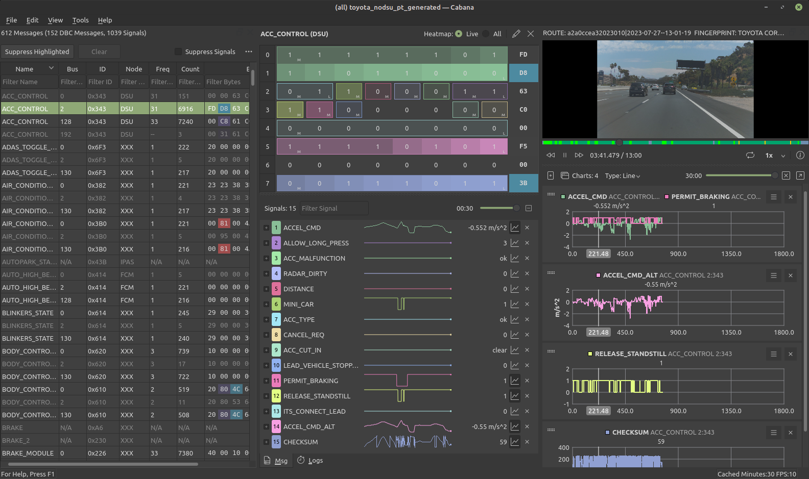

## Cabana: CAN Bus Visualizer & Analyzer

Cabana is a Qt-based graphical tool for viewing, analyzing, and reverse-engineering raw CAN bus data. It supports creating and editing DBC (Database CAN) files, plotting signals over time, and optional synchronized video playback.

Cabana was originally developed by the repository author for the [openpilot](https://github.com/commaai/openpilot), and is now maintained as a standalone, general-purpose CAN analysis tool.

It supports multiple CAN data sources, including:

- SocketCAN interfaces
- comma.ai panda hardware
- Live streaming via ZMQ/Msgq
- Recorded logs (openpilot routes or custom formats)

No openpilot installation is required. Cabana is suitable for automotive diagnostics, CAN reverse-engineering, research, and any project involving CAN networks.

## Prerequisites

Before running or compiling **openpilot-cabana**, install these dependencies.

### Ubuntu / Debian

```bash
sudo apt update
sudo apt install -y g++ clang capnproto libcurl4-openssl-dev libzmq3-dev libssl-dev libbz2-dev libavcodec-dev libavformat-dev libavutil-dev libswscale-dev libavdevice-dev libavfilter-dev libffi-dev libgles2-mesa-dev libglfw3-dev libglib2.0-0 libjpeg-dev libncurses5-dev libusb-1.0-0-dev libzstd-dev libcapnp-dev opencl-headers ocl-icd-libopencl1 ocl-icd-opencl-dev qttools5-dev-tools libqt5charts5-dev libqt5svg5-dev libqt5serialbus5-dev libqt5x11extras5-dev libqt5opengl5-dev

```

## Clone, Compile

### Clone the repository

```bash
git clone https://github.com/deanlee/openpilot-cabana.git
cd openpilot-cabana
git submodule update --init --recursive
```

### Install Python packages

```bash
python3 -m pip install --upgrade pip
python -m pip install --no-cache-dir scons numpy "cython>=3.0" setuptools pycapnp
```

### Build

```bash
scons
```

## Download Precompiled Binary

You can also download a precompiled binary from the [Releases](https://github.com/deanlee/openpilot-cabana/releases) page:

```bash
# Make executable
chmod +x cabana-linux-x86_64

# Run the demo route
./cabana-linux-x86_64 --demo
```

## Usage Instructions

```bash
$ ./cabana -h
Usage: ./cabana [options] route

Options:
  -h, --help                     Displays help on commandline options.
  --help-all                     Displays help including Qt specific options.
  --demo                         use a demo route instead of providing your own
  --auto                         Auto load the route from the best available source (no video):
                                 internal, openpilotci, comma_api, car_segments, testing_closet
  --qcam                         load qcamera
  --ecam                         load wide road camera
  --msgq                         read can messages from msgq
  --panda                        read can messages from panda
  --panda-serial <panda-serial>  read can messages from panda with given serial
  --socketcan <socketcan>        read can messages from given SocketCAN device
  --zmq <ip-address>             read can messages from zmq at the specified ip-address
                                 messages
  --data_dir <data_dir>          local directory with routes
  --no-vipc                      do not output video
  --dbc <dbc>                    dbc file to open

Arguments:
  route                          the drive to replay. find your drives at
                                 connect.comma.ai
```

## Examples

### Running Cabana in Demo Mode
To run Cabana using a built-in demo route, use the following command:

```shell
cabana --demo
```

### Loading a Specific Route

To load a specific route for replay, provide the route as an argument:

```shell
cabana "a2a0ccea32023010|2023-07-27--13-01-19"
```

Replace "0ccea32023010|2023-07-27--13-01-19" with your desired route identifier.


### Running Cabana with multiple cameras
To run Cabana with multiple cameras, use the following command:

```shell
cabana "a2a0ccea32023010|2023-07-27--13-01-19" --dcam --ecam
```

### Streaming CAN Messages from a comma Device

[SSH into your device](https://github.com/commaai/openpilot/wiki/SSH) and start the bridge with the following command:

```shell
cd /data/openpilot/cereal/messaging/
./bridge &
```

Then Run Cabana with the device's IP address:

```shell
cabana --zmq <ipaddress>
```

Replace &lt;ipaddress&gt; with your comma device's IP address.

While streaming from the device, Cabana will log the CAN messages to a local directory. By default, this directory is ~/cabana_live_stream/. You can change the log directory in Cabana by navigating to menu -> tools -> settings.

After disconnecting from the device, you can replay the logged CAN messages from the stream selector dialog -> browse local route.

### Streaming CAN Messages from Panda

To read CAN messages from a connected Panda, use the following command:

```shell
cabana --panda
```

### Using the Stream Selector Dialog

If you run Cabana without any arguments, a stream selector dialog will pop up, allowing you to choose the stream.

```shell
cabana
```
